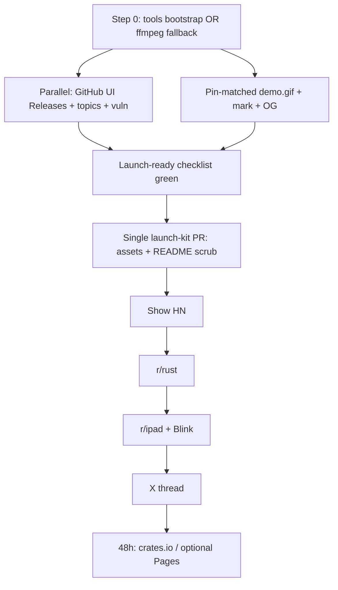

# wscrpt — Brand, Launch Surfaces & Go-to-Market Design

| Field | Value |
| --- | --- |
| **Document** | Brand / launch / GTM design |
| **Product** | [wscrpt](https://github.com/wcasse/wscrpt) |
| **Author** | Brand / launch designer (draft for Will Casse) |
| **Date** | 2026-08-01 |
| **Status** | Draft (rev 5 — open questions resolved by Will 2026-08-01) |
| **Repo tip at writing** | **`main` / `origin/main` may be ahead of install pin** (verified: tip has sticky checklist fan-out after tag). Prior tags immutable. |
| **Install pin (public, today)** | **`v0.2.2`** on origin — SoT for claims/install/demo. Resolve SHA with `git rev-parse v0.2.2` (do not assume tip == pin). |
| **Source of truth for launch gates** | **`docs/STATUS.md` + `docs/PUBLISH_RUNBOOK.md`** (not stale checklist rows) |
| **Grounding** | `README.md`, `CHANGELOG.md`, `docs/STATUS.md`, `docs/OPEN_SOURCE_CHECKLIST.md` (stale warning), `docs/PUBLISH_RUNBOOK.md`, `docs/releases/v0.2.{0,1,2}.md`, `docs/demo.tape`, `Cargo.toml`, `src/render.rs` Pro ANSI palette |

---

## Overview

**wscrpt** is an open-source, remote-first terminal IDE built for people who develop on a real macOS/Linux host and type from a thin client — especially **iPad + Magic Keyboard → Blink → mosh/SSH → tmux**. It ships a deliberate small core (editing, workspace tools, trust-gated tasks, bounded LSP, resilient sessions) with honest non-goals. Agent orchestration and a native playback viewport exist as product lanes and must not dominate launch claims **ahead of the published install pin**.

This document is an executable launch kit for **imminent public release**. It freezes brand identity, a tonight-capable visual package, MVP landing content, ordered launch surfaces aimed at **sincere users who would get real value**, and a ruthless critical path that respects ops reality: tags `v0.2.0` / `v0.2.1` / **`v0.2.2`** exist on origin; GitHub Release pages, topics, private vuln reporting, and crates.io remain **credential-blocked** (`gh` token invalid per STATUS); **`vhs` / `ttyd` may be missing** on the launch host (ffmpeg often present).

**North star:** maximize quality of first-week conversation among iPad/Blink remote coders and Rust terminal people — not empty hype, not VS Code–remote migrants who will bounce and leave bad issues.

**Hard rule:** landing README claim surface ≡ **install pin** (today **`v0.2.2`**), **not** whatever is on `main`. Demo GIF ≡ that same pin binary. Source of truth for Essential controls: **`git show v0.2.2:README.md`** (or `git show $PIN:README.md`). Tip-only chords (today: sticky checklist fan-out `Esc w C` / `Esc w Y`) stay off the landing table until a later pin tag. No announce until the [Launch-ready definition](#51-ruthless-prioritization) checklist is green.

---

## Background & Motivation

### Current state (facts)

Prefer **`docs/STATUS.md`** over checklist rows when they disagree. As of 2026-08-01:

| Item | Reality today |
| --- | --- |
| Public repo | https://github.com/wcasse/wscrpt |
| **Install pin** | `cargo install --git https://github.com/wcasse/wscrpt --tag v0.2.2 --locked` (STATUS: strangers install this tag; **never move tags**) |
| Tags on origin | `v0.2.0`, `v0.2.1`, **`v0.2.2`** (**do not move any of them**) |
| **Tip vs pin** | **`main`/`origin/main` is ahead of `v0.2.2`** (post-tag landings OK per STATUS). Tip includes sticky checklist fan-out; **install pin does not** until **v0.2.3+** |
| crates.io | Not published (`cargo login` still needed); git tag remains the reproducible pin |
| GitHub Releases pages | Draft notes in `docs/releases/` for 0.2.0–0.2.2; **pages not created** (`gh` token invalid — use **GitHub web UI**) |
| Topics | Empty / blocked on auth |
| Private vuln reporting | Blocked on settings/auth; `SECURITY.md` already points there |
| Demo | `docs/demo.tape` (vhs) → intended `docs/assets/demo.gif` (**directory/GIF not present**). Assets **excluded from crates.io package** via `Cargo.toml` `exclude` — **not** gitignored; GIF can be committed |
| Brand assets | **None** in tree |
| Positioning / voice | Strong in README and release notes (developer-tool honest) |
| **Pin surface (`v0.2.2` tag README)** | Floating Stickies pad (`Esc w k`/`K`); Agents run/cancel (`Esc w a`/`x`); Agents dashboard (`Esc w D`); fake-by-default (see `docs/releases/v0.2.2.md`). **Not** on pin: checklist fan-out |
| **Tip-only (not pin)** | `Esc w C` / `Esc w Y` sticky checklist run/apply (STATUS: landed after tag as post-0.2.2). Default-branch README currently lists these — **must scrub for launch** |
| **CHANGELOG drift** | Tip `CHANGELOG.md` may fold checklist fan-out under closed **`[0.2.2]`** even though the published tag does not include it — **ship hygiene:** move tip-only items to `[Unreleased]` / next patch before launch docs freeze |
| Tooling on review host | `gh` auth **invalid**; `vhs` **missing**; `ttyd` **missing**; `ffmpeg` often available |
| Local noise files | `BIRDWORLD`, job lists, publish checklist are **gitignored / untracked** — not a git cleanup PR for public clones |

### Pain points this design fixes

1. **No mark / social face** — GH/X unfurls generic without OG + mark.
2. **No demo GIF** — weak first impression without Esc→tools motion.
3. **Credential gates** — Releases + topics + vuln reporting still open (STATUS).
4. **Claim-surface drift** — default-branch README can tip-ahead of pin (live: `Esc w C`/`Y` on `main`, absent on `v0.2.2` tag README).
5. **Wrong-audience magnet** — without hard who-not, HN/r/rust noise.
6. **Agent overclaim** — pin includes dashboard + fake agent; easy to misread as autonomous ACP.

### Why launch now works

- Deliberate 0.2 core + 0.2.2 daily surfaces are coherent on the **published pin**.
- Install-from-tag path for **`v0.2.2`** is the advertised README install.
- MIT, SECURITY, CONTRIBUTING, issue templates present.
- Release note drafts for 0.2.0–0.2.2 exist; 0.2.2 notes already bound agent claims (fake-by-default).
- Comparison table in README is already a viral-friendly pain→fix artifact.

---

## Goals & Non-Goals

### Goals

1. Freeze **name, tagline, voice, visual system**.
2. Ship a **tonight-capable brand kit** usable in README and posts (tools bootstrap included).
3. Sequence **sincere** launch surfaces: Releases → README+GIF (pin-matched) → Show HN → r/rust → r/ipad / Blink → X.
4. Keep **README + demo + posts ≡ install pin**; never ahead of a published tag.
5. Success metrics for **sincere users**, not vanity.
6. Paste-ready copy for posts.

### Non-Goals

- Full design system / multi-page marketing site day 0.
- Product Hunt day 0.
- Paid ads / fake social proof / AI-agent headline.
- crates.io install as primary before publish.
- Rebranding away from `wscrpt`.
- Treating local gitignored noise files as a merge blocker.
- Blocking “repo is public” on full human iPad matrix (matrix remains *wide recommendation* confidence gate).

---

## Key Decisions

| # | Decision | Rationale |
| --- | --- | --- |
| 1 | **Canonical name: `wscrpt`** (lowercase, no dots) | Matches crate, binary, GitHub, config paths. |
| 2 | Reject `W.SCRPT`; avoid public `w.scrpt` | Vaporware / copy-paste friction. |
| 3 | **Primary tagline:** *Terminal IDE for Mac and Linux — iPad-first, any solid SSH client.* | Category + iPad design target without implying Blink-only. |
| 4 | **Install pin is the only launch claim surface** | Public install today = **`v0.2.2`**. Claims never lead the pin **or** the tip. Hero narrative stays remote-first / Esc reliability — agents are secondary and scoped (fake-by-default; no autonomous ACP headline). |
| 4a | **Landing README ≡ `git show $PIN:README.md` for launch day** | Essential controls SoT is the **tag tree**, not `main`. Diff default-branch table against pin README; **reject tip-only keys**. For pin `v0.2.2`: include pad + `Esc w a`/`x`/`D`; **exclude** `Esc w C`/`Y` (checklist fan-out) and any other STATUS post-tag chords. Still refuse “autonomous coding agent” overclaim. |
| 5 | Tonight site = **GitHub README + Release notes**; Pages optional 48h | Sincere users start at the repo. |
| 6 | **Demo GIF P0**, recorded from **pin binary only** | Shareability without lying. Never record from dirty tip. |
| 7 | Visual system = dark Pro-adjacent surfaces + **indigo `#6366F1` primary brand accent** (not product ANSI cyan) | Marketing identity distinct from Terminal Pro cyan chrome; hex tokens are brand tokens. |
| 8 | Show HN + r/rust first; r/ipad + Blink second; PH deferred | Sincere technical audience first. |
| 9 | Handles: personal amplify for tonight; `@wscrpt` later if free | **Will 2026-08-01:** no X brand-account hunt tonight. |
| 10 | **Honesty section** is first-class launch surface | Filters wrong audience. |
| 11 | **Tonight implementation = one launch-kit PR** (assets + pin-matched README); process gates via GitHub UI | 8-PR ladder is post-structure, not same-session merge theater. |

---

## Proposed Design

### 1. Brand identity

#### 1.1 Name treatment

| Form | Use | Verdict |
| --- | --- | --- |
| **`wscrpt`** | Canonical: binary, crate, headings, posts, wordmark | **Primary** |
| `w.scrpt` | Informal only | **Avoid in public** |
| `W.SCRPT` / `Wscrpt` | Period / title branding | **Reject** |

**Pronunciation:** prefer **“wuh-script”**; optional once in FAQ. Always pair first mention: “**wscrpt** — remote-first terminal IDE”.

#### 1.2 Positioning statement

> **For** developers who code on a real Linux or macOS host from a thin client (especially iPad + Magic Keyboard over Blink / SSH / mosh / tmux),  
> **wscrpt** is a remote-first terminal IDE  
> **that** keeps ordinary typing ordinary and puts workspace tools behind a no-timeout Esc action layer,  
> **unlike** vim modal timeouts, VS Code remote desktop weight, or GUI IDEs that assume Command-key chords and mouse capture.

#### 1.3 Taglines

| Role | Line |
| --- | --- |
| **Primary** | Terminal IDE for Mac and Linux — iPad-first, any solid SSH client. |
| Backup A | Remote-first terminal IDE. Escape never times out. |
| Backup B | Code on the host. Type from the iPad. Stay in the terminal. |

- Primary: README hero, Show HN, Release subtitle, X bio.  
- Backup A: r/rust.  
- Backup B: r/ipad, Blink.

#### 1.4 Voice / tone

| Do | Don't |
| --- | --- |
| Concrete remote/Blink facts | “Delightful mobile experience” |
| “Deliberate small core” / “not a VS Code clone” | “Full IDE” / feature laundry |
| Host, trust gate, action layer | “Supercharge”, “10x”, “AI-native platform” |
| Install in two lines | Funnel CTAs |
| Admit human iPad matrix gate | Fake social proof |

**Voice one-liner:** *Terminal tool honesty — a man page that wants you to succeed, not a Series A landing page.*

#### 1.5 Visual system

**Source of truth for product color:** ANSI indexes and comments in `src/render.rs` (`pro_fg_default` → Ansi **255**, comments **245**, bright cyan **51**, magenta **201**, green **46**, yellow **226**, constants **220**, edit-transition bg **58**, body often **`Color::Reset`** so host Terminal Pro background shows through — **not** a hardcoded `#0B0B0C` in the editor).

**Web / social palette = approximation** of that Pro session look for OG images, mark, and optional Pages — **not** pixel-identical product tokens. Do not write brand-extraction scripts that scrape hex from this table into Rust.

| Token | Hex | Derivation / role |
| --- | --- | --- |
| `bg` | `#0B0B0C` | **Marketing** near-black stand-in for host Pro bg (editor uses `Reset`) |
| `bg-elevated` | `#1A1A1C` | Cards / code blocks on web only |
| `fg` | `#F5F5F7` | Near-white body (≈ Ansi 255 “near pure white”) |
| `fg-muted` | `#A1A1A6` | Secondary (≈ Ansi 245) |
| `accent-indigo` | `#6366F1` | **Primary brand accent** (marketing mark / OG / style bible). Product TUI may still use Pro ANSI cyan in-editor — that is not the public brand accent. |
| `accent-magenta` | `#FF00FF` | Action-layer / keyword accent — ≈ Ansi 201 |
| `accent-green` | `#00FF00` | Success / install — ≈ Ansi 46 |
| `accent-amber` | `#FFD700` | Warm caution / EDIT* marketing accent — closer to Ansi **220/226** than soft One Dark gold; **not** Ansi 58 (edit row lift) |
| `danger` | `#FF0000` | Errors — ≈ Ansi 196 |
| `border` | `#2C2C2E` | Hairlines (web only) |

**Do not** use: purple AI gradients, glassmorphism, Inter-on-white SaaS hero, VS Code marketplace chrome, Matrix-green-as-whole-brand, robot mascots.

**Typography:** mono wordmark (JetBrains Mono / IBM Plex Mono / SF Mono); system UI for body; no ultra-black italic display faces.

---

### 2. Logo / graphic package

#### 2.1 Mark concept — Esc-w

- Canvas `#0B0B0C` (marketing bg).
- Mono lowercase **`w`** in `#F5F5F7`.
- Left indigo `#6366F1` **action chevron** (Esc prefix), stroke thick enough to read at **16px** and **32px** (prefer ≥22–28 viewBox units on 512 canvas; test mark-16 and mark-32 before ship).
- No periods, 3D, gradients, or AI “play” triangle.
- Magenta baseline tick **optional**; drop if noisy at 16px.

**Ownership tonight (Will 2026-08-01):** **delegate to agent** — implement Esc-w mark + OG exports from this spec inside **PR-L1**. One clean SVG with paths (not live font dependency). Pixel-perfect kerning is polish-later. **Accept one clean SVG** for launch.

**Secondary (later):** terminal frame mark for OG only.

**Wordmark:** `wscrpt` mono. README prefers one-liner over giant FIGlet:

```text
wscrpt — terminal IDE for Mac and Linux
```

#### 2.2 Deliverables

**Tonight (inside launch-kit PR)**

| Asset | Spec |
| --- | --- |
| `docs/assets/mark.svg` | 512×512 Esc-w, paths |
| `docs/assets/mark-32.png` | 32×32 |
| `docs/assets/avatar-400.png` | 400×400 (X / circular crop safe) |
| `docs/assets/og-1200x630.png` | 1200×630 mark + wordmark + primary tagline + repo URL |
| `docs/assets/demo.gif` | From **pin binary** only; ≤ ~5 MB |
| `docs/assets/README.md` | Re-record policy + export commands |

**Polish-later:** wordmark.svg, full icon set, light-bg mark, 1080 square card.

#### 2.3 Sizes by surface

| Surface | Size | Format |
| --- | --- | --- |
| GitHub social / OG | 1200×630 (GH also accepts ~1280×640) | PNG |
| README demo | ~800–1200 wide | GIF |
| X avatar | 400×400 | PNG |
| X header | 1500×500 | PNG (48h ok) |
| Reddit post image | 1200×675 or 1080² | PNG/GIF |
| Favicon / apple-touch | 32 + 180 | PNG/ICO |
| Product Hunt | defer | — |

**Export commands (pick one toolchain present):**

```sh
# From docs/assets/ after mark.svg exists
# Option A: resvg
resvg mark.svg -w 32 -h 32 mark-32.png
resvg mark.svg -w 400 -h 400 avatar-400.png
# Option B: Inkscape
inkscape mark.svg -w 32 -h 32 -o mark-32.png
# Option C: macOS ql/sips after manual export from Preview
sips -z 32 32 mark-export.png --out mark-32.png
sips -z 400 400 mark-export.png --out avatar-400.png
```

OG: compose in any editor (Figma/Preview/ImageMagick) on `#0B0B0C` with mark + `wscrpt` + primary tagline + `github.com/wcasse/wscrpt`.

**GitHub repo social preview:** uploading `og-1200x630.png` to the repo is not enough by itself. After commit: **GitHub → repo Settings → General → Social preview** (or equivalent) → upload the PNG if the UI exposes it. Link unfurls also improve once the image is linked from README/Release and caches refresh.

**SVG construction (conceptual → convert text to paths before commit):**

```svg
<svg xmlns="http://www.w3.org/2000/svg" viewBox="0 0 512 512" role="img" aria-label="wscrpt">
  <rect width="512" height="512" fill="#0B0B0C"/>
  <!-- chevron: keep stroke ≥ ~28 on 512 so 16px raster still reads -->
  <path d="M150 176 L108 256 L150 336" fill="none" stroke="#6366F1"
        stroke-width="28" stroke-linecap="square" stroke-linejoin="miter"/>
  <!-- replace <text> with outlined paths in final asset -->
  <text x="300" y="310" text-anchor="middle"
        font-family="ui-monospace, SFMono-Regular, Menlo, monospace"
        font-size="200" font-weight="500" fill="#F5F5F7">w</text>
</svg>
```

---

### 3. Website / landing

#### 3.1 Tonight MVP vs later

| Phase | What | Host |
| --- | --- | --- |
| **Tonight** | Pin-matched README + Release notes + demo GIF + mark/OG | github.com/wcasse/wscrpt |
| **48h** | Optional `docs/www` static page | GitHub Pages |
| **1w+** | Custom domain only if free attention | optional |

#### 3.2 Single-page structure (README order)

1. Hero (tagline + install + GIF)  
2. Who for / not  
3. Why not vim / VS Code remote / nano (matrix)  
4. Install (pin tag primary)  
5. Demo note  
6. Features for **pin version only**  
7. Honesty  
8. Contributing / License  

Optional footer: *Development on `main` may include experimental agent UI and Stickies pad changes — see CHANGELOG `[Unreleased]`. Install from a tag.*

#### 3.3 Hero + install + honesty (paste-ready)

**Hero**

```markdown
# wscrpt

**Terminal IDE for Mac and Linux — iPad-first, any solid SSH client.**

Remote-first editing on macOS/Linux over SSH, mosh, and tmux. Ordinary typing
stays ordinary. `Esc` (or `Ctrl-K`) opens a **no-timeout** action layer. Mouse
stays **off by default** so Blink can keep native touch selection.


```

**Install (pin today = `v0.2.2`; re-check STATUS before paste)**

```sh
cargo install --git https://github.com/wcasse/wscrpt --tag v0.2.2 --locked
wscrpt --health
```

If crates.io is not live yet, replies: *git tag is the reproducible pin; crates.io will be one-line install after publish.*

**Honesty**

```markdown
## Honesty (read this)

- **Not** a VS Code clone. No extension marketplace, no full Git client, no multi-file LSP refactor suite.
- **Stickies (v0.2.2):** floating top-right notepad (`Esc w k` / `Esc w K`) — personal notes in XDG state; team notes under `.wscrpt/stickies/`.
- **Agents (v0.2.2):** dashboard + plan-first **fake** agent by default (`Esc w a` / `x` / `D`). Host-auth readiness is reported by `--health`. **Not** claimed: autonomous merge/push, provider marketplace, or “ACP live out of the box.”
- **Not in install pin yet:** sticky checklist fan-out (`Esc w C` / `Esc w Y`) may exist on `main` tip only — wait for a later tag.
- **Preview / native iPad player:** `previewd/` and `clients/` are contributor experiments; **not** part of `cargo install wscrpt`.
- **iPad matrix:** host CI is green; full human Blink pass is the confidence gate for wide recommendation ([docs/IPAD_BLINK_QA.md](docs/IPAD_BLINK_QA.md)).
```

**Launch-kit Essential controls ≡ pin tag README** (`git show v0.2.2:README.md`). For **`v0.2.2`** that means:

| Include (on pin tag) | **Exclude while pin = `v0.2.2`** (tip-only today) | Still do not overclaim |
| --- | --- | --- |
| Stickies pad: `Esc w k` / `Esc w K` (floating notepad) | **`Esc w C` / `Esc w Y`** sticky checklist run / apply-after-review | Autonomous coding / merge / push |
| Agents: `Esc w a` / `Esc w x` (run/cancel) | Any other chord STATUS marks post-tag / not in install pin | “ACP is live out of the box” |
| Agents dashboard: `Esc w D` (single row; do not duplicate) | Duplicate/conflicting agent rows only on tip | VS Code parity / full Git client |
| Trusted Git stage/unstage/commit, first-edit cue, core workspace/LSP/tasks | Maintainer-only `.grok/workflows/*` sticky S3 as product surface | — |

**How to scrub (PR-L1 acceptance):**

```sh
PIN=v0.2.2
# Working tree Essential controls must match pin (no tip-only extras)
git show "$PIN:README.md" | sed -n '/## Essential controls/,/^## /p' > /tmp/pin-essentials.md
# Manually or script-diff against README.md Essential controls section.
# Fail launch-kit if README lists Esc w C / Esc w Y (or any key absent from pin).
```

Optional footer after Honesty (not Essential table): *Development on `main` may include experimental keys (e.g. sticky checklist fan-out) not in the install pin — see CHANGELOG and STATUS.*

#### 3.4 Demo strategy — **pin-binary only**

Tape facts (verified): `Output docs/assets/demo.gif`, 1200×720, `WSCRPT_SKIP_FIRST_RUN_HELP=1`, flow Quick Open → sidebar `wS` → search `ws` → palette → quit. Assets stay **git-tracked** for GitHub; **excluded from crates.io** via `Cargo.toml` `exclude` (not `.gitignore`).

**Step 0 — tools (timebox 15–30m)**

```sh
# Prefer vhs path
brew install vhs ttyd ffmpeg   # or equivalent; stop if >30m and use fallback

# Fallback if vhs/ttyd blocked: ffmpeg screen capture of pin binary
# (same Esc flow; scrub personal paths; do not record scratch/ or local job lists)
```

**Record from install pin — never untagged tip / dirty WIP**

```sh
# PIN from STATUS (today: v0.2.2). Substitute when pin moves.
PIN=v0.2.2

# Recommended: isolated worktree at tag
cd "/path/to"
git -C wscrpt fetch origin tag "$PIN"
git -C wscrpt worktree add "../wscrpt-demo-$PIN" "$PIN"
cd "../wscrpt-demo-$PIN"
cargo build --release
mkdir -p docs/assets
export WSCRPT_SKIP_FIRST_RUN_HELP=1
export PATH="$PWD/target/release:$PATH"
which wscrpt && wscrpt --version   # must match PIN (e.g. 0.2.2)

# If vhs available:
vhs docs/demo.tape
# Copy GIF into main tree for the launch-kit commit:
# cp docs/assets/demo.gif "/path/to/wscrpt/docs/assets/"

# Alternate: install pin binary only
cargo install --git https://github.com/wcasse/wscrpt --tag "$PIN" --locked --force
# Point tape / PATH at ~/.cargo/bin/wscrpt and record in a clean sample dir
```

**Re-record policy** (`docs/assets/README.md`): re-render on each **published** release so GIF never drifts from install pin UI. Hero GIF should keep the Esc → Quick Open → sidebar → search → palette flow (tape default) — **do not** make agents the visual hero even when pin includes the dashboard. Optional second asset later: pad or dashboard glimpse.

Optional tape upgrades (EDIT* cue, physical iPad still) = post-launch.

---

### 4. Launch surfaces & viral path

#### 4.1 Ordered channel plan



| Order | Channel | When |
| --- | --- | --- |
| 0 | **Releases + topics + private vuln reporting** (GitHub UI if `gh` broken) | **Hard gate before any post** — parallel with assets |
| 1 | Launch-kit: pin GIF + mark/OG + README scrub/honesty | Before posts |
| 2 | **Show HN** | **Tonight** once launch-ready + PR-L1 pass; owner free **2–4h** for replies (Will 2026-08-01) |
| 3 | **r/rust** | Same night or +few hours after HN |
| 4 | **r/ipad** + Blink hangout | After rust |
| 5 | **X** | After HN/repo link exists — **personal account** (no brand-handle hunt tonight) |
| 6 | crates.io | **Later** (24–48h ok when `cargo login` works) — **not** an announce blocker |
| 7 | Pages / PH / domain / iPad photo | Not tonight; 48h / ≥1 week |

**Blink hangout (pre-find before r/ipad):** use the current Blink community surface the operator already knows — typically **Blink’s Discord** (linked from [blink.sh](https://blink.sh) / App Store support) and/or Blink GitHub discussions/issues for the client. Do not invent a URL; open blink.sh once, grab the live invite, put it in the maintainer run note. If no Discord access, skip to r/ipad only.

**Coverage plan (locked):** **Show HN tonight** as soon as Releases/topics/vuln + PR-L1 + acceptance test are green. Stay available **2–4h** for replies. Do not wait for crates.io, domain, iPad photo, or X brand account.

#### 4.2 Post templates

**Pin substitution:** all snippets below use **`v0.2.2`** (current STATUS pin). If pin moves, replace the tag string only — keep non-goal closers.

##### Show HN

**Title**

```text
Show HN: wscrpt – remote-first terminal IDE for iPad + Blink (SSH/mosh)
```

**Body**

```text
I built wscrpt because coding on a real Linux/macOS host from an iPad
(Blink → mosh/tmux) kept fighting me: Escape timeouts dumping keys into the
buffer, mouse capture killing touch selection, and tools that assume desktop
Command-key chords.

wscrpt is a remote-first terminal IDE (Rust, MIT):

- Ordinary typing stays ordinary
- Esc / Ctrl-K opens a no-timeout action layer
- Mouse reporting off by default (Blink-friendly)
- Workspace tools: Quick Open, search, trust-gated tasks, bounded LSP,
  sessions/recovery, floating Stickies pad
- Agents dashboard with a plan-first *fake* agent by default (not autonomous ACP)
- Deliberate small core — not a VS Code clone

Install (macOS/Linux host) — git tag is the reproducible pin
(crates.io when published):

  cargo install --git https://github.com/wcasse/wscrpt --tag v0.2.2 --locked
  wscrpt --health

Repo: https://github.com/wcasse/wscrpt

Happy to answer questions about the input model, trust gates, or remote
resilience. Please don't expect full LSP refactor / multi-pane embedded
terminals / autonomous merge-and-push agents — intentional non-goals.
```

##### r/rust

**Title**

```text
wscrpt 0.2.2 — remote-first terminal IDE (iPad/Blink-friendly, MIT, Rust)
```

**Body**

```text
**What:** Remote-first terminal IDE for real development hosts, optimized for
thin clients (especially iPad + Magic Keyboard over Blink/SSH/mosh/tmux).

**Why Rust / why this vs existing TUI editors:** Focus is remote input reliability
and a small trusted core (tasks trust-gated; LSP only from user-global config),
not VS Code parity. 0.2.2 adds a floating Stickies pad and an Agents dashboard
(safe fake agent by default).

**Install** (git tag is the reproducible pin until crates.io):

```sh
cargo install --git https://github.com/wcasse/wscrpt --tag v0.2.2 --locked
wscrpt --health
```

**Link:** https://github.com/wcasse/wscrpt

MSRV 1.88, CI on macOS + Linux. Feedback on packaging, input reliability, and
trust boundaries welcome. Not claiming autonomous coding agents or full Git UI.
```

##### r/ipad

**Title**

```text
Dev tool: wscrpt — terminal IDE meant for iPad + Magic Keyboard via Blink
```

**Body**

```text
If you SSH/mosh from Blink into a real Mac/Linux box and want more than raw vim
without running a full remote desktop:

wscrpt keeps typing normal, uses Esc for a no-timeout command layer (no Command-key
IDE chords), and leaves mouse off so Blink touch selection still works.

Install on the *host* (not on the iPad):

```sh
cargo install --git https://github.com/wcasse/wscrpt --tag v0.2.2 --locked
```

Then: Blink → mosh user@host → tmux → wscrpt .

https://github.com/wcasse/wscrpt

Not an App Store IDE — it runs on the remote host in the terminal.
Deliberate small core (not a VS Code remote clone). Happy to answer Blink/mosh setup questions.
```

##### X / Twitter thread (5 posts)

```text
1/ wscrpt — terminal IDE for Mac and Linux, iPad-first, any solid SSH client.
   Esc never times out. Mouse off by default. MIT / Rust.
   github.com/wcasse/wscrpt

2/ The pain: Blink → mosh → tmux → editor, and Escape delays dump keys into
   your buffer. Or the tool captures mouse and kills touch selection.

3/ The fix: ordinary typing stays ordinary. Esc/Ctrl-K opens a no-timeout
   action layer. Workspace tools without GUI remote desktop.
   Stickies pad + Agents dashboard (fake agent by default) in 0.2.2.

4/ Install on the host (git tag pin; crates.io later):
   cargo install --git https://github.com/wcasse/wscrpt --tag v0.2.2 --locked
   wscrpt --health

5/ Not a VS Code clone. No autonomous merge/push agents.
   Demo GIF in the README. Questions welcome.
```

#### 4.3 Shareability without lying

| Asset | Why |
| --- | --- |
| Pain→fix table | Empathy |
| GIF from **pin** binary | Proof |
| “Escape never times out” | Memorable + testable |
| “Mouse off by default for Blink” | Hyper-specific trust |
| Explicit non-goals | Attracts adults |

#### 4.4 Claim hygiene

| Feature | Launch language while pin = **`v0.2.2`** |
| --- | --- |
| Editing, workspace, tasks, LSP, sessions, recovery | Shipped (0.2 core) |
| Stickies **list** v1 | Shipped in **0.2.1**; superseded UX in 0.2.2 |
| Floating top-right Stickies **pad** | Shipped **0.2.2** — OK to document / key-table |
| Trusted stage/commit, first-edit cue | Shipped **0.2.1+** |
| Agents dashboard + fake run loop (`Esc w a` / `x` / `D`) | Shipped **0.2.2** — say **fake-by-default** |
| Sticky checklist fan-out (`Esc w C` / `Esc w Y`) | **Tip only** (post-tag on `main`; STATUS: not in install pin until **v0.2.3+**) — **do not** key-table, demo, or post |
| Maintainer sticky workflows (S3 `.grok/workflows/*`) | Contributor/maintainer only; not cargo-install product surface |
| Autonomous agent / ACP “live out of the box” / merge-push | **Do not claim** |
| previewd / iPad harness | Contributor experiment; not in cargo install |
| Untagged tip / next patch | **Not public** until new pin tag on origin |

Hero narrative still leads with **remote Esc reliability + Blink**, not agents.

---

### 5. Tonight critical path vs post-launch

#### 5.1 Ruthless prioritization

##### Definition of launch-ready (copy into STATUS when green)

```text
[ ] gh auth fixed OR GitHub web UI used
[ ] Release pages live for v0.2.0, v0.2.1, and v0.2.2 (notes from docs/releases/*.md)
[ ] Repo topics: terminal, editor, ide, ssh, mosh, ipad, rust
[ ] Private vulnerability reporting enabled
[ ] Install pin binary verified: cargo install --tag v0.2.2 --locked && wscrpt --health
[ ] Browser: CI badge green on default branch
[ ] demo.gif recorded from PIN binary only (Esc workspace flow; not agent-hype hero)
[ ] mark.svg + avatar-400 + og-1200x630 committed
[ ] GitHub social preview image set if Settings UI allows
[ ] Default-branch README Essential controls ≡ `git show v0.2.2:README.md`
      (include pad + Esc w a/x/D; **exclude Esc w C / Esc w Y** and other tip-only keys)
[ ] Honesty section present (fake-by-default agents / preview / matrix / non-goals)
[ ] Tip CHANGELOG does not present post-tag features as closed [0.2.2] without a note
      (prefer [Unreleased] / next patch for checklist fan-out)
[ ] Posts only advertise tags that exist on origin; no checklist fan-out marketing
[ ] Owner available ~2–4h after Show HN
```

**Do not announce** until this list is green. Brand assets alone are not enough (credential hard gate).

##### Step 0 — tools (before demo clock)

| Path | Action | Timebox |
| --- | --- | --- |
| A | `brew install vhs ttyd ffmpeg` (or nix/cargo equiv.) | 15–30m |
| B | If blocked: **ffmpeg** (or QuickTime → ffmpeg) capture of pin binary | 20–40m |
| C | Credentials: `gh auth login` **or** open GitHub Releases UI immediately | parallel |

##### Tonight workstreams (realistic single operator)

| Stream | Work | Notes |
| --- | --- | --- |
| **A — Process (parallel, hard gate)** | Releases UI, topics, vuln reporting | Not blocked on code PR merge |
| **B — Assets** | Pin demo + Esc-w SVG/PNG/OG (**agent implements mark/OG per spec**) | After Step 0 |
| **C — Docs** | One **launch-kit** PR-L1: assets + README pin scrub + honesty | Single PR tonight |
| **D — Announce** | **Show HN tonight** → r/rust → … | Only after launch-ready; Will covers 2–4h |

**Not tonight (Will 2026-08-01):** crates.io publish, physical iPad photo, custom domain buy, X `@wscrpt` hunt, Pages site, Product Hunt, multi-PR ladder, inventing Blink URLs, pixel-perfect mark kerning, re-tagging existing tags.

```mermaid
gantt
  title Launch window (realistic)
  dateFormat HH:mm
  axisFormat %H:%M
  section Step0
  Install vhs+ttyd OR commit to ffmpeg fallback :crit, t0, 00:00, 30m
  section Process_parallel
  Releases + topics + vuln via UI     :crit, p0, 00:00, 45m
  section Assets
  Pin binary demo.gif                 :crit, a1, after t0, 45m
  Esc-w mark + OG exports             :a2, 00:15, 40m
  section Docs
  Launch-kit PR README scrub          :crit, d1, after a1, 30m
  section Announce
  Show HN only if checklist green     :crit, s1, after d1, 15m
```



#### 5.2 Success metrics (sincere)

| Metric | Success | Vanity trap |
| --- | --- | --- |
| Stars from real accounts | Interest | Giveaway spikes |
| Issues with host/iPad detail | Operators | “Make VS Code” piles |
| HN/Reddit talk of Escape/Blink/mosh | Message fit | “Yet another editor” only |
| Install / `--health` reports | Trials | Bookmark-only |
| Zero walk-back on agents/preview/pin | Trust | Silent overclaim |

Directional: 1–3 quality HN comments on action layer; ≥1 Blink/iPad install story.

---

### 6. Risks (severity-ranked)

| Risk | Sev | Mitigation |
| --- | --- | --- |
| Wrong audience expects full VS Code remote | **High** | Who-not + Honesty + Show HN closer; KD 4a / A6 |
| Overclaiming autonomous agents / ACP / preview | **High** | Pin claim hygiene §4.4; fake-by-default language; package excludes `previewd/`/`clients/` |
| Brand looks like vaporware / AI wrapper | **Med** | Esc-w + Pro palette approximation; no robot mascot; no AI tagline |
| Name hard to pronounce / search | **Med** | Always pair “wscrpt — terminal IDE”; optional FAQ pronunciation |
| README/GIF ahead of install pin (incl. tip keys like `Esc w C`/`Y`) | **High** | KD 4a + §3.3 exclude table + pin-only demo §3.4 + acceptance test |
| crates.io delay / “incomplete without crates” | **Low–Med** | “Git tag is the reproducible pin” reply in posts |
| Human iPad matrix not fully filed | **Med** | Frame as wide-recommendation confidence gate; don’t claim every Blink version |
| `gh` auth / Releases/topics/vuln still blocked | **High (ops)** | Launch-ready checklist §5.1; GitHub web UI path; **no announce until green** |
| Name collision / handle squatting | **Low** | Claim crates.io + `@wscrpt` when free |

---

## API / Interface Changes

No product API. Public surface inventory:

| Surface | Value | Action |
| --- | --- | --- |
| GitHub | `wcasse/wscrpt` | Exists |
| crates.io | `wscrpt` | Publish when token ready |
| X | `@wscrpt` if free | Claim or skip |
| Social preview | `docs/assets/og-1200x630.png` | Upload in repo Settings |

---

## Data Model Changes

None. Static assets under `docs/assets/` (git-tracked; **crate-excluded**). GIF budget ≤ ~5 MB.

---

## Alternatives Considered

### A1. `w.scrpt` / `W.SCRPT` primary — **Reject** (install friction / vaporware).

### A2. Custom domain + multi-page site before announce — **Reject** (time sink; thin page = vaporware).

### A3. Lead with agentic + preview narrative — **Reject** (overclaim vs pin).

### A4. Product Hunt day 0 — **Defer** ≥1 week.

### A5. Abstract geometric mark unrelated to Esc — **Reject** (loses story).

### A6. Freeze README to install-pin surface for launch (**recommended**) vs announce from evolving `main`

| Option | Pros | Cons |
| --- | --- | --- |
| **A6a Freeze landing README ≡ pin tag tree** (recommended) | Zero key mismatch; no walk-back | Tip features (checklist fan-out) hidden until next pin |
| A6b Cut a newer pin tag (e.g. `v0.2.3`) first, then announce | Can document tip checklist keys honestly | Packaging/Release cost; still no autonomous-agent overclaim |
| A6c Announce tip README while install stays `v0.2.2` | Zero packaging work | **Users try `Esc w C`/`Y` missing on pin** — unacceptable |

**Decision:** **A6a** with pin **`v0.2.2`**: scrub tip-only keys from default-branch Essential controls (or only under an explicit “Development on main” note — never the main key table). Never A6c.

---

## Security & Privacy Considerations

| Topic | Guidance |
| --- | --- |
| Assets / GIF | No secrets, tokens, private hostnames, personal email |
| Demo content | Prefer this public repo or throwaway tree; scrub `$HOME` paths in live capture |
| Live capture fallback | **Do not** record `scratch/`, local job lists, `BIRDWORLD`, or other gitignored personal notes |
| Install instructions | Only `cargo install --git … --tag <PIN> --locked` — never curl\|sh |
| Auth | Never paste `gh` / crates tokens into issues or posts |
| Audits | Do not claim security audits; point at trust gates + SECURITY.md |
| Pages analytics | Default **off** |

---

## Observability

GitHub Insights (clones, views, referrers). Issue labels for install/host. Qualitative coding of first 20 HN/Reddit comments. CI badge check in browser before Show HN (`gh` may be 401). No product telemetry / no Pages trackers by default.

---

## Rollout Plan

### Phase 0 — Process + tools (parallel)

1. Step 0 tools decision (vhs path vs ffmpeg).  
2. `gh auth login` **or** GitHub UI: create Releases from `docs/releases/v0.2.{0,1,2}.md` (**do not re-create or move tags**).  
3. Topics + private vulnerability reporting.  
4. Tick launch-ready process boxes in STATUS.

### Phase 1 — Launch-kit (one PR) — **tonight**

1. Record demo from **pin** binary.  
2. **Agent** implements Esc-w mark + PNG exports + OG from this design spec; set GitHub social preview if UI allows.  
3. README: tagline, GIF, honesty, **Essential controls scrub to pin**.  
4. Merge **PR-L1** only (kit — no optional extras).

### Phase 2 — Announce — **tonight after Phase 0+1 green**

1. **Show HN immediately** (Will available **2–4h** for replies).  
2. r/rust → r/ipad + Blink → X on **personal** account.  
3. Install copy keeps **git tag `v0.2.2`** as pin; crates.io is not required.

### Phase 3 — 48h (not announce-blocking)

1. **crates.io** when `cargo login` works (Will: later).  
2. Triage FAQ from HN/Reddit.  
3. Optional Pages; re-record GIF only if pin UI confusion.  
4. Optional later: X handle claim, domain, iPad photo.

### Phase 4 — 1w+

PH go/no-go; human iPad matrix for wide confidence; checklist fan-out marketing **only** after a pin that includes it.

### Rollback

- Wrong claim → edit README + Release notes text; correct in-thread.  
- Tags **never move**; fixes → new patch tag.  
- Bad GIF → replace asset on pin policy.

---

## Open Questions

All product/ops open questions for launch night are **resolved by Will (2026-08-01)**. No further debate.

| # | Question | Decision | Date |
| --- | --- | --- | --- |
| 1 | X handle `@wscrpt`? | **Defer** — no brand-account hunt tonight; amplify from personal X after HN | 2026-08-01 |
| 2 | crates.io tonight or later? | **Later** — git tag **`v0.2.2`** remains install pin; publish when `cargo login` works (24–48h ok). **Do not block announce** on crates.io | 2026-08-01 |
| 3 | Physical iPad photo tonight? | **No** — kit only | 2026-08-01 |
| 4 | Show HN tonight vs weekday morning? | **Tonight** — as soon as Releases/topics/vuln + PR-L1 + acceptance test pass; stay **2–4h** for replies | 2026-08-01 |
| 5 | Domain this week? | **No** — not tonight; revisit only if free attention later | 2026-08-01 |
| 6 | Install pin for announce? | **`v0.2.2`** on origin; fake-by-default agent honesty; tip keys scrubbed | resolved earlier + still final |
| 7 | Who owns mark SVG paths tonight? | **Delegate to agent** — implement Esc-w + OG from this spec in **PR-L1** | 2026-08-01 |
| 8 | Optional extras tonight? | **None** — launch kit only | 2026-08-01 |

---

## Launch acceptance test

Run before Show HN (engineer or owner):

1. On a **clean machine or fresh cargo install**:  
   `cargo install --git https://github.com/wcasse/wscrpt --tag v0.2.2 --locked && wscrpt --version && wscrpt --health`  
2. Diff **default-branch README** Essential controls against **`git show v0.2.2:README.md`**. No tip-only extras (`Esc w C` / `Esc w Y` must be absent). Every listed chord exists on the pin binary.  
3. Open `docs/assets/demo.gif`: recorded from pin binary; Esc workspace flow (not agent-hype-only / not checklist fan-out); chrome matches pin.  
4. GitHub Release pages for **v0.2.0 / v0.2.1 / v0.2.2** exist; topics non-empty; private vuln reporting on.  
5. CI badge green in browser.  
6. No post draft claims autonomous ACP, checklist fan-out, or a version not on origin tags.

---

## References

- **Launch gates SoT:** `docs/STATUS.md`, `docs/PUBLISH_RUNBOOK.md`  
- **Checklist:** `docs/OPEN_SOURCE_CHECKLIST.md` — useful for OSS hygiene history; **publish/tag rows may lag STATUS** (as of 2026-08-01 prefer STATUS; refresh checklist in a docs PR when convenient). **Do not re-create tags** from stale “tag missing” language if STATUS says tags are on origin.  
- README at pin (Essential SoT): `git show v0.2.2:README.md`  
- Tip vs pin: STATUS “Sticky checklist fan-out on main … until v0.2.3”  
- `docs/releases/v0.2.0.md`, `v0.2.1.md`, `v0.2.2.md`  
- `docs/demo.tape`, `CHANGELOG.md`, `docs/HOST_SUPPORT.md`, `docs/IPAD_BLINK_QA.md`, `docs/ARCHITECTURE.md`  
- Product ANSI palette: `src/render.rs` (`pro_*`)  
- Package identity / exclude: `Cargo.toml`  
- GitHub: https://github.com/wcasse/wscrpt  

---

## PR Plan

**Tonight (execute):** **one launch-kit PR** (+ GitHub UI process). The numbered PRs below are a backlog decomposition for reviewability if work spans sessions — **not** eight same-night merges.

### Tonight subset (must)

| Work | Form | Depends |
| --- | --- | --- |
| **Process: Releases + topics + vuln** | GitHub UI / `gh` when fixed — update `docs/STATUS.md` checkboxes | None — **start in parallel** with assets; **must complete before Show HN tonight** |
| **PR-L1 launch-kit** | Single PR — **agent owns Esc-w mark + OG** | Demo tools decision |

#### PR-L1 — `docs: launch kit (pin demo, mark, pin-matched README)`

| Field | Content |
| --- | --- |
| **Title** | `docs: launch kit — pin demo, brand mark, README claim freeze` |
| **Files** | `docs/assets/demo.gif`, `docs/assets/mark.svg`, `docs/assets/mark-32.png`, `docs/assets/avatar-400.png`, `docs/assets/og-1200x630.png`, `docs/assets/README.md`, `README.md` |
| **Depends on** | None for branch work; **Show HN tonight** depends on process gate + this PR merge + acceptance test |
| **Owner** | Agent implements mark/OG from design §2; pin demo + README scrub per claim hygiene |
| **Description** | (1) Record `demo.gif` from **install pin binary only** (`PIN=v0.2.2` worktree or `cargo install --tag v0.2.2`) — never untagged tip. (2) **Agent:** Esc-w SVG + export PNGs + OG per §2 (Will delegated 2026-08-01). (3) README: primary tagline, GIF embed, Honesty section; **Essential controls ≡ `git show v0.2.2:README.md`** — include pad + `Esc w a`/`x`/`D`; **scrub `Esc w C`/`Y` and any tip-only keys**; no autonomous ACP. Reject PR if default-branch key table has chords absent from pin. (4) Prefer moving tip-only CHANGELOG rows out of closed `[0.2.2]` into `[Unreleased]` if still wrong on tip. (5) Document re-record policy in `docs/assets/README.md`. **No optional extras** (no domain, iPad photo, crates.io, X brand account). |

### Post-announce / 48h+ backlog

#### PR2 — `docs: add launch channel templates` (optional same night if energy)

| Field | Content |
| --- | --- |
| **Title** | `docs: add LAUNCH.md channel templates` |
| **Files** | `docs/LAUNCH.md` |
| **Depends on** | PR-L1 preferred |
| **Description** | Paste-ready posts, launch-ready checklist, claim hygiene. Maintainer-facing. **Not a Show HN blocker** if posts are already in this design doc. |

#### PR3 — `docs(www): optional Pages landing`

| Field | Content |
| --- | --- |
| **Title** | `docs: minimal docs/www landing` |
| **Files** | `docs/www/*` |
| **Depends on** | PR-L1 |
| **Description** | 48h+ only. No analytics. |

#### PR4 — `docs: refresh OPEN_SOURCE_CHECKLIST publish rows from STATUS`

| Field | Content |
| --- | --- |
| **Title** | `docs: sync open-source checklist gates with STATUS` |
| **Files** | `docs/OPEN_SOURCE_CHECKLIST.md`, maybe `docs/STATUS.md` |
| **Depends on** | Process Releases done |
| **Description** | Mark tags present, Releases done/pending honestly; **never** imply re-tagging. Demote stale “push main / tag missing” language. |

#### PR5 — `chore: confirm local noise stays gitignored` (no-op if clean)

| Field | Content |
| --- | --- |
| **Title** | `chore: verify gitignore for private notes` (only if needed) |
| **Files** | `.gitignore` only if a pattern missing |
| **Depends on** | None |
| **Description** | `BIRDWORLD`, job lists, checklist are already gitignored/untracked. **Do not** open a PR to “delete” them from git history — they are not tracked. Operator: don’t force-add them. |

#### PR6 — `docs: crates.io install path live`

| Field | Content |
| --- | --- |
| **Title** | `docs: promote crates.io install after publish` |
| **Files** | `README.md`, `docs/STATUS.md` |
| **Depends on** | Successful `cargo publish` |
| **Description** | Post-announce when token works. |

### Merge / process sequence

1. **Start Releases/topics/vuln (UI) immediately** — parallel with PR-L1 assets; **must finish before Show HN tonight**.  
2. Step 0 tools → pin demo; **agent** builds Esc-w mark + OG.  
3. Land **PR-L1** only (kit — no extras).  
4. Launch acceptance test.  
5. **Show HN tonight**; Will covers 2–4h. r/rust → r/ipad/Blink → personal X.  
6. **crates.io later** (PR6) when token works — not a blocker.  
7. PR2–PR5 as capacity allows post-announce.

---

*End of design document (rev 5 — open questions resolved by Will 2026-08-01).*
